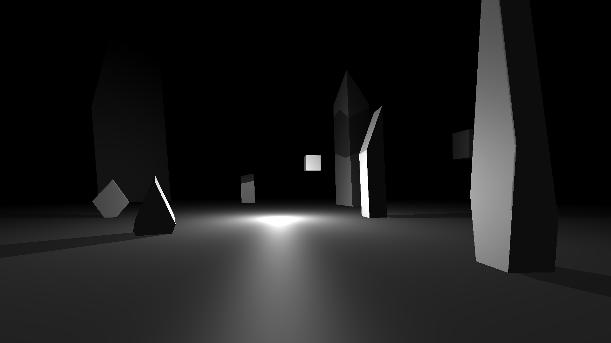
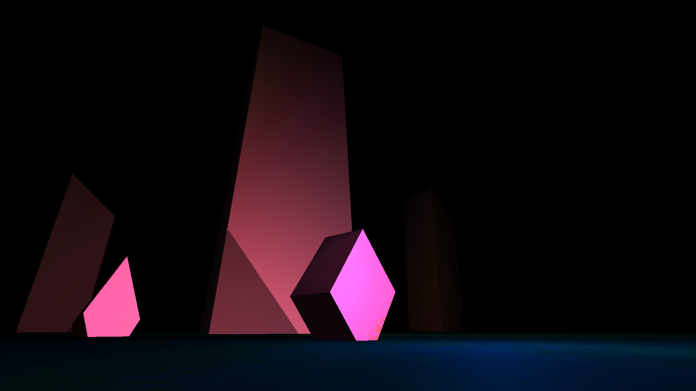

# Love2D-3D-Tools
A set of Lua modules that provide an easy starting point in using 3D elements in love2D.  
Love2d 0.11 provides many new features in the 3d department, but it still requires quite a lot of effort to get things going. Provided here is a way to get textured objects in a blinn-phong shaded environment with shadow casting in under 100 lines.  
A demo is included:

Fly around with WASD, move camera with arrow keys, fullscreen with F.  
For usage details see the demoSrc included.
